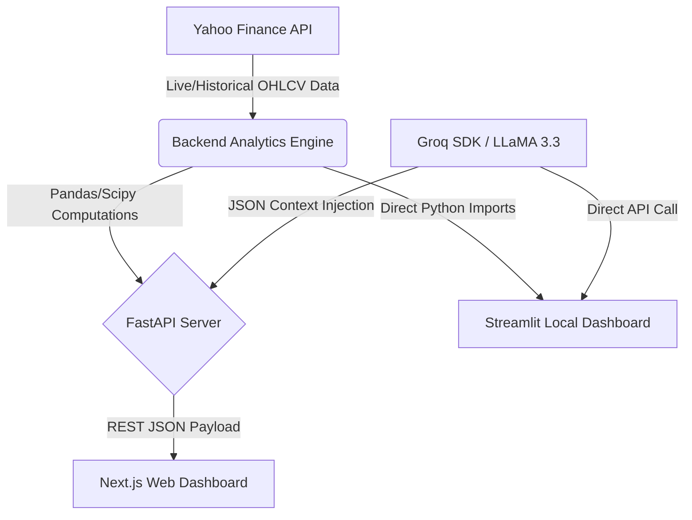

<p align="center">
  
  
  
  
  
</p>

<h1 align="center">Binary Investor (SheepOrSleep)</h1>
<h3 align="center">AI-Powered Behavioral Bias Detector for Indian Stocks</h3>

<p align="center">
  <em>Complete Technical Documentation covering Architecture, Algorithms, Methods, and Tooling</em>
</p>

---

## 📖 1. Project Overview & Objective

Retail investors in the Indian stock market consistently underperform the fundamental indices. This underperformance is rarely due to poor stock selection, but rather **behavioral biases**—specifically **Herd Mentality** (buying at the top when everyone else does) and **Panic Selling** (dumping shares during temporary market corrections). 

**Binary Investor (SheepOrSleep)** is an institutional-grade behavioral analytics engine that mathematically quantifies these biases in real-time. By utilizing cross-sectional variance models, stochastic simulations, multi-variate statistical anomaly detection, and bleeding-edge Large Language Models (LLMs), the platform alerts investors when a stock is experiencing extreme emotional trading, allowing them to remain disciplined.

---

## 🏗️ 2. System Architecture

The project is built on a highly modular, decoupled architecture supporting **two identical frontends** (a lightweight web dashboard and an intensive local analytics UI), powered by a single mathematical backend.



### Architectural Modules:
1. **Data Ingestion (`yfinance`)**: Fetches OHLCV (Open, High, Low, Close, Volume) limits and market cap data streams.
2. **Statistical Engine (`analytics/` & `server.py`)**: The mathematical core that computes regressions and z-scores dynamically without relying on a rigid database.
3. **AI Copilot (`ai/groq_client.py`)**: A retrieval-enhanced LLaMA-3.3 engine restricted to a strict behavioral-finance persona.
4. **Decoupled User Interfaces**:
    - **Streamlit (`app.py`)**: A heavy local analytics client offering dynamic Plotly charts and immediate Python execution.
    - **Next.js (`binary-investor/`)**: A fast, client-rendered web dashboard utilizing Tailwind CSS and Recharts for public-facing deployments.

---

## 🔬 3. Algorithms, Techniques & Methods

The core value of the platform lies in the sophisticated financial modeling used to detect human emotion.

### A. Herding Detection: The CCK Model (Chang, Cheng, and Khorana)
To detect if the market is blindly moving together, we implement the cross-sectional absolute deviation (CSAD) methodology.
- **Methodology**: 
  1. We retrieve the daily returns of *all stocks* within a specific sector (e.g., NIFTY 50 Banking).
  2. We calculate the equal-weighted sector market return ($R_{m,t}$).
  3. We calculate the CSAD: $\text{CSAD}_t = \frac{1}{N}\sum | R_{i,t} - R_{m,t} |$
- **Quadratic Regression**: We run an Ordinary Least Squares (OLS) regression using Numpy/Scipy:
  $$\text{CSAD}_t = \alpha + \gamma_1 |R_{m,t}| + \gamma_2 R_{m,t}^2 + \varepsilon_t$$
- **Interpretation**: Under normal conditions, CSAD increases linearly with market returns (stocks diverge naturally). If $\gamma_2$ is **negative** and statistically significant (p-value < 0.05 determined by T-Statistics), the normal linear relationship has collapsed. Stocks are moving in unison regardless of fundamentals—**Proving Herd Mentality**.

### B. Multi-Factor Panic Scoring Algorithm
We compute a weighted 0-100 Panic Score using five distinct mathematical indicators:
1. **Volume Anomalies (30% Weight)**: We calculate the rolling 20-day Simple Moving Average (SMA) of volume. We then execute a **Z-Score** standardization. If the Z-Score is $>2$ (2 standard deviations above the mean) concurrently with negative price returns, intense panic is flagged.
2. **Delivery Pressure Proxy (20% Weight)**: We assess the daily True Range normalized against the close price $\frac{\text{High} - \text{Low}}{\text{Close}}$. Expanding ranges without upward price momentum indicate heavy speculatory dumping.
3. **Price-Volume Divergence (25% Weight)**: We check for negative 5-day momentum in price (<-3%) coupled with positive 5-day momentum in volume (>30%).
4. **Drawdown Severity (15% Weight)**: Distance of the current closing price from the expanding historical peak.
5. **Volatility Regime (10% Weight)**: We calculate the annualized rolling standard deviation (Volatility). We flag if current volatility is severely detached from the historical mean.

### C. Stochastic Monte Carlo Simulation
To prove the cost of emotional trading, we use a stochastic random walk simulation.
- **Method**: Using historical Mean ($\mu$) and Standard Deviation ($\sigma$) of the stock's returns, we generate a synthetic 10-year period of trading days using `numpy.random.normal`.
- **Simulation**: We run **500 parallel universe simulations** where prices mathematically evolve.
- **The Contestants**:
  - *Disciplined SIP*: Continuously invests a fixed amount regardless of market conditions.
  - *Panic Seller*: Dumps all equity to cash immediately when a 10% peak-to-trough drawdown is detected, remaining in cash for 90 days out of fear before re-entering.
- **Result Output**: Generates an array of final portfolio values, dynamically aggregated into histogram bins via `numpy.histogram` to prove standard SIP virtually always wins.

### D. The Behavior Gap Correlation
We execute a Pearson Correlation Coefficient ($r$) test between normalized trading volume and normalized price bounds. Positive correlation identifies when retail volume surges exactly at peak heights (buying the top) and crashes at the bottom (selling low). We multiply this correlation penalty by the true CAGR to determine the real-rupee "Behavior Gap" of the stock.

---

## 🛠️ 4. Tech Stack & Tools Used

### Backend & Core Analytics
- **Language**: `Python 3.10+`
- **Math & Statistics**: `Pandas` (DataFrames, rolling averages, aggregations), `NumPy` (Vectorized OLS regressions, Monte Carlo simulations), `SciPy` (T-Distribution CDFs for p-value extraction).
- **API Framework**: `FastAPI` (High performance, async routing) & `Pydantic` (Data validation and schema creation).
- **Server**: `Uvicorn` (ASGI web server implementation).

### Artificial Intelligence
- **Platform**: `Groq` (Cloud LPUS for sub-second text inference).
- **Model**: `LLaMA-3.3-70b-versatile` running via the Groq Python SDK. Protected by a stringent Context-Injection System Prompt limiting the AI strictly to Behavioral Finance analysis.

### Local Dashboard (Streamlit Frontend)
- **Framework**: `Streamlit 1.30+` (Fast UI prototyping in Python).
- **Visualizations**: `Plotly` (Interactive candlestick and dual-axis charts).

### Web Dashboard (Next.js Frontend)
- **Core Framework**: `Next.js 16` based on `React 19`.
- **Styling**: `Tailwind CSS v4` (Utility-first CSS, dark-glass-morphism themes).
- **Graphics**: `Recharts` for accessible, scalable SVG histograms and scatter plots.
- **Icons & Typography**: `Lucide React` and standard Google Web Fonts.

### External APIs
- **Financial Data**: `yfinance` to bypass expensive API endpoints and scrape Yahoo Finance's live tick, historical OHLCV, and company metadata privately.

---

## 📂 5. Project Directory Structure

```text
/TechKrutiVerse
├── README.md                 # Complete system documentation
├── requirements.txt          # Python dependency list
├── .env.example              # Environment variables template
│
├── server.py                 # (Root) FastAPI Application & Endpoints
├── app.py                    # (Root) Streamlit Web App Entry Point
│
├── analytics/                # Standalone Math Engines
│   └── herd_detector.py      # Pandas logic for CCK regressions & CSAD
├── ai/                       # Groq LLM integration
├── config/                   # Stock universe & API constraints
├── data/                     # Data fetching layers (yfinance wrappers)
├── ui/                       # Streamlit custom components & CSS
│
└── binary-investor/          # Deeply Decoupled Web UI
    ├── package.json          # Node dependencies (Next.js, Tailwind, Recharts)
    └── app/                  # Next.js App Router (Pages & Layouts)
```

---

## 🚀 6. Setup & Installation Instructions

**Prerequisites:** 
- `Python 3.10+`
- `Node.js 18+` and `npm`
- A free `Groq API Key` from [console.groq.com](https://console.groq.com)

**1. Clone the Repository & Configure Environment**
```bash
git clone https://github.com/YashHelge/TGPCET_Team_Red_Horse.git
cd TGPCET_Team_Red_Horse

# Copy environment template
cp .env.example .env
# Edit .env and paste: GROQ_API_KEY=gsk_your_key_here
```

### Option A: Run the Next.js + FastAPI Stack (Web Deployment)
```bash
# Terminal 1: Install Python packages and run FastAPI Engine
pip install -r requirements.txt
uvicorn server:app --host 0.0.0.0 --port 8001

# Terminal 2: Install and run Next.js Web Dashboard
cd binary-investor
npm install
npm run dev
# Open http://localhost:3000 in your browser
```

### Option B: Run the Streamlit Stack (Local Analytics)
```bash
# Make sure you are in the root directory and pip requirements are installed
pip install -r requirements.txt
streamlit run app.py
# The local interactive dashboard will open instantly at http://localhost:8501
```

---

## 👥 7. Team Details
- **Team name:** Red Horse
- **Member 1:** Kritish Bokde
- **Member 2:** Yash Helge

---

## 🔮 8. Future Roadmap & Iterations
- **Deep Learning Model Swaps**: Upgrading the CCK OLS model to a multi-variate `LSTM` (Long Short-Term Memory) neural network in TensorFlow to actively forecast herd events rather than just detecting them post-factum.
- **Brokerage API Hooks**: Utilizing Zerodha/Upstox APIs to pipe real user portfolio data into the behavior gap calculator.
- **Sub-Second Streaming**: Transitioning HTTP `GET` loops in the UI to WebSockets for live millisecond tick updates.