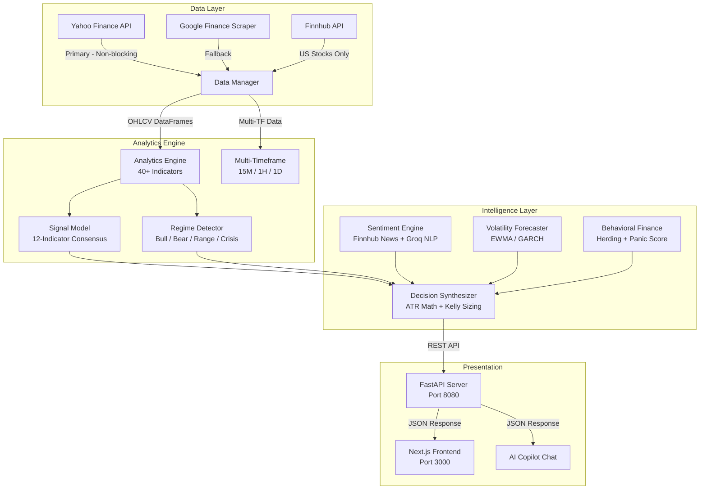

<p align="center">
  
  
  
  
  
</p>

<h1 align="center">TradeOS v2.0</h1>
<h3 align="center">Math-First, Institutional-Grade Stock Intelligence Platform</h3>

<p align="center">
  <em>Deterministic trading decisions powered by 12-indicator weighted consensus, ATR-based risk management, and Kelly Criterion position sizing — not AI opinions.</em>
</p>

---

## 📖 Table of Contents

1. [Project Overview](#-1-project-overview--philosophy)
2. [System Architecture](#-2-system-architecture)
3. [Core Decision Engine](#-3-core-decision-engine)
4. [Signal Model — 12-Indicator Consensus](#-4-signal-model--12-indicator-weighted-consensus)
5. [Risk Management Mathematics](#-5-risk-management-mathematics)
6. [Data Pipeline](#-6-data-pipeline)
7. [Sentiment Analysis & News Sources](#-7-sentiment-analysis--news-sources)
8. [Behavioral Finance Analytics](#-8-behavioral-finance-analytics)
9. [40+ Technical Indicators](#-9-40-technical-indicators)
10. [Market Regime Detection](#-10-market-regime-detection)
11. [Multi-Timeframe Confluence](#-11-multi-timeframe-confluence)
12. [Security & Infrastructure](#-12-security--infrastructure)
13. [Tech Stack & Libraries](#-13-tech-stack--libraries)
14. [Project Structure](#-14-project-structure)
15. [Setup & Installation](#-15-setup--installation)
16. [API Reference](#-16-api-reference)
17. [Configuration](#-17-configuration)
18. [Deployment](#-18-deployment)
19. [Team](#-19-team)

---

## 🧭 1. Project Overview & Philosophy

### The Problem

Most retail trading platforms rely heavily on either:
- **AI/LLM-generated numbers** — which hallucinate prices, fabricate entry points, and produce non-reproducible decisions, or
- **Simple indicator overlays** — which display raw RSI/MACD values without synthesizing them into an actionable signal.

Both approaches fail under real market conditions. An LLM doesn't understand that a $0 entry price is meaningless. A standalone RSI reading of 45 tells you nothing without context from trend, volume, volatility, and regime.

### The Solution: Math-First Architecture

**TradeOS v2.0** solves this by making every trading decision **deterministic and mathematically reproducible**:

| Component | How It Works |
|---|---|
| **Signal Generation** | 12 weighted technical indicators vote BUY/SELL/HOLD — pure arithmetic, no ML |
| **Entry / SL / TP** | Computed from ATR (Average True Range) mathematics, not generated by AI |
| **Position Sizing** | Half-Kelly Criterion adjusted for volatility regime |
| **Risk/Reward** | Automatically calculated from ATR multiples (1.5:1 minimum) |
| **LLM Role** | Writes human-readable reasoning commentary **only** — never decides the action or sets any price |

Every output can be verified by hand. If you know the ATR, the support/resistance levels, and the indicator readings, you can reproduce the exact same decision the system produces.

### Key Design Principles

1. **Transparency** — Every decision shows which of the 12 indicators voted bullish, bearish, or neutral
2. **Reproducibility** — Same data always produces the same result (no randomness, no LLM dependency)
3. **Self-Healing** — Graceful degradation when data sources fail (Yahoo → Google → Finnhub fallback)
4. **Expert Trader Logic** — The system doesn't panic. Crisis mode requires stronger conviction before acting

---

## 🏗️ 2. System Architecture



### Architecture Modules

| Module | File | Purpose |
|---|---|---|
| **Data Manager** | `v2/data/data_manager.py` | Orchestrates all data fetching with TTL caching |
| **Real-Time Scraper** | `v2/data/realtime_scraper.py` | Yahoo-first quote fetching with Google/Finnhub fallback |
| **Historical Data** | `v2/data/historical.py` | yfinance OHLCV with multi-period support |
| **Analytics Engine** | `v2/analytics/engine.py` | Computes 40+ technical indicators from raw OHLCV |
| **Signal Model** | `v2/models/signal_model.py` | 12-indicator weighted consensus (the core decision math) |
| **Decision Synthesizer** | `v2/models/decision_synthesizer.py` | Combines signals → action + Entry/SL/TP/Size (pure math) |
| **Regime Detector** | `v2/models/regime_detector.py` | Classifies market into 4 regimes using statistical methods |
| **Sentiment Engine** | `v2/models/sentiment_engine.py` | News scraping + Groq NLP for sentiment scoring |
| **Volatility Model** | `v2/models/volatility_model.py` | EWMA/GARCH volatility forecasting |
| **Stock Universe** | `v2/data/stock_universe.py` | 200+ global stocks (NSE, NYSE, NASDAQ, LSE, TSE, HKEX, XETRA) |
| **FastAPI Server** | `v2/main.py` | REST API with CORS, rate limiting, security headers |
| **Next.js Frontend** | `binary-investor/` | React 19 dashboard with interactive charts |

---

## 🧮 3. Core Decision Engine

The `AlgorithmicDecisionEngine` in `decision_synthesizer.py` is the brain of the system. It combines multiple independent mathematical signals into a single trading decision.

### Decision Pipeline

```
Step 1: Fetch OHLCV data → Yahoo Finance (async, non-blocking)
Step 2: Compute 40+ indicators → EMA, MACD, RSI, Bands, etc.
Step 3: Detect market regime → BULL_TRENDING / BEAR_TRENDING / LOW_VOL_RANGE / HIGH_VOL_CRISIS
Step 4: Run 12-indicator consensus → Weighted vote → BUY/SELL/HOLD probabilities
Step 5: Compute 6-category confluence → Trend + Volume + Sentiment + Volatility + Multi-TF + Consensus
Step 6: Calculate conviction score → consensus × 3 + confluence × 0.5 + prob_edge × 2
Step 7: Compare vs regime-adjusted threshold → final action
Step 8: If BUY/SELL → compute Entry/SL/TP using ATR math → compute Position Size using Half-Kelly
Step 9: Generate reasoning commentary via Groq LLM (optional, non-critical)
```

### Conviction Score Formula

The final trading action is determined by an **aggregate conviction score** — not by any single indicator or AI model:

```
conviction = (consensus_score × 3.0) + (confluence_score × 0.5) + (probability_edge × 2.0)
```

Where:
- **`consensus_score`** (range: -1 to +1): The weighted average from 12 technical indicators
- **`confluence_score`** (range: -6 to +6): How many independent analysis categories agree (trend, volume, sentiment, volatility, multi-TF, consensus)
- **`probability_edge`**: P(BUY) - P(SELL) from the indicator consensus probabilities

### Regime-Adjusted Thresholds

| Market Regime | BUY Threshold | SELL Threshold | Why |
|---|---|---|---|
| `BULL_TRENDING` | ≥ 1.0 | ≤ -1.8 | Easier to buy in uptrends, harder to contra-sell |
| `BEAR_TRENDING` | ≥ 2.0 | ≤ -1.2 | Cautious buying, easier to sell with the trend |
| `LOW_VOL_RANGE` | ≥ 1.5 | ≤ -1.5 | Balanced — needs moderate conviction both ways |
| `HIGH_VOL_CRISIS` | ≥ 2.5 | ≤ -2.5 | Expert doesn't panic — very high bar for any action |

**Why this matters:** In a BULL_TRENDING market, a conviction of 1.2 will trigger BUY. In CRISIS mode, the same 1.2 conviction stays HOLD — mimicking how an experienced trader avoids whipsaws during panic.

---

## 📊 4. Signal Model — 12-Indicator Weighted Consensus

The `IndicatorConsensus` class in `signal_model.py` replaces the previous XGBoost ML model (which had only 27.5% accuracy) with a deterministic weighted voting system.

### How It Works

Each indicator produces a score between **-1** (strong sell) and **+1** (strong buy). These scores are multiplied by their assigned weights and summed to produce the final consensus:

$$\text{consensus} = \frac{\sum w_i \cdot s_i}{\sum w_i}$$

### Indicator Table

| # | Indicator | Weight | Signal Logic | Why This Weight |
|---|---|---|---|---|
| 1 | **EMA Alignment** (9/21/50) | 2.0× | +1 if 9 > 21 > 50 (bullish stack), -1 if reversed | Trend is the strongest edge in markets |
| 2 | **MACD Histogram** | 1.5× | Positive histogram = bullish momentum accelerating | Momentum confirmation prevents false breakouts |
| 3 | **RSI (14)** | 1.5× | < 30 → oversold (buy), > 70 → overbought (sell) | Mean reversion at extremes is statistically profitable |
| 4 | **OBV Trend** | 1.5× | Rising OBV with price = accumulation (smart money) | Volume confirms price — without it, moves fail |
| 5 | **Stochastic %K/%D** | 1.0× | < 20 → buy, > 80 → sell (with %K crossing %D) | Catches reversals at extremes |
| 6 | **SuperTrend** | 1.0× | Price above SuperTrend band = bullish trend | Clean trend-following signal, noise-filtered |
| 7 | **VWAP Position** | 1.0× | Price above VWAP = institutional buying interest | Institutional traders use VWAP as key benchmark |
| 8 | **Bollinger Band %B** | 1.0× | %B < 0 → oversold, > 1 → overbought | Volatility-adjusted extremes detect squeeze setups |
| 9 | **Volume Anomaly** | 1.0× | Z-score > 2 with price move = confirmed breakout | Anomalous volume validates directional moves |
| 10 | **Price Momentum** (5d/20d) | 1.0× | Dual-timeframe momentum slope | Short + medium momentum alignment confirms trend |
| 11 | **ADX +DI/-DI** | 0.5× | ADX > 25 + DI direction determines trend strength | ADX is noisy alone — low weight, used as confirmation |
| 12 | **MFI (14)** | 1.0× | < 20 → buy, > 80 → sell (volume-weighted RSI) | Integrates both price and volume into one oscillator |

### Crisis Regime Adjustments

In `HIGH_VOL_CRISIS` mode, the weights are automatically adjusted:
- **RSI, Bollinger** weights increase by **1.5×** (mean reversion works better in panics)
- **Momentum, OBV** weights decrease by **0.5×** (momentum is unreliable in crisis)

This ensures the system doesn't chase momentum during market crashes but instead looks for oversold reversals.

### Output

```json
{
  "action": "BUY",
  "confidence": 0.42,
  "probabilities": { "BUY": 0.42, "SELL": 0.28, "HOLD": 0.30 },
  "consensusScore": 0.31,
  "bullishIndicators": 7,
  "bearishIndicators": 3,
  "indicatorBreakdown": {
    "ema_alignment": 1.0,
    "macd": 0.3,
    "rsi": 0.0,
    "stochastic": -0.5,
    "supertrend": 0.5,
    "obv": 0.7,
    "vwap": 0.241,
    "bollinger": 0.0,
    "volume_anomaly": 0.0,
    "momentum": 0.3,
    "adx": 0.5,
    "mfi": 0.2
  }
}
```

---

## 📐 5. Risk Management Mathematics

All entry, stop-loss, take-profit, and position sizing values are computed using **pure mathematics** — the LLM never touches these numbers.

### ATR-Based Level Computation

**ATR (Average True Range)** measures volatility by averaging the true range over 14 periods. The system uses ATR as the unit of risk:

| Level | BUY Formula | SELL Formula |
|---|---|---|
| **Entry** | Current market price | Current market price |
| **Stop Loss** | `max(price - 2×ATR, support × 0.99)` | `min(price + 2×ATR, resistance × 1.01)` |
| **Take Profit 1** | `price + 3×ATR` | `price - 3×ATR` |
| **Take Profit 2** | `max(price + 5×ATR, resistance)` | `min(price - 5×ATR, support)` |

**Why 2×ATR for stop-loss?** Academic research (Wilder, Kase) shows that 2×ATR absorbs normal price noise while still protecting against genuine reversals. A tighter stop (1×ATR) gets stopped out too often; a wider stop (3×ATR) risks too much capital.

**Why 3×ATR for TP1?** This creates a minimum **1.5:1 Risk/Reward ratio**, which is the break-even R:R for a 40% win rate — well within the range of most systematic strategies.

### Kelly Criterion Position Sizing

The **Kelly Criterion** determines the mathematically optimal fraction of capital to risk:

$$f^* = \frac{p \cdot b - q}{b}$$

Where:
- `p` = probability of winning (from indicator consensus confidence)
- `q` = 1 - p (probability of losing)
- `b` = reward/risk ratio (TP1 distance / SL distance)

**Half-Kelly**: To reduce the risk of ruin from estimation errors, the system uses **Half-Kelly** (`f*/2`). This sacrifices ~25% of theoretical growth rate but reduces drawdowns by ~50%.

### Regime and Volatility Adjustments

| Condition | Position Size Adjustment |
|---|---|
| `HIGH_VOL_CRISIS` | Cap at 2% of portfolio (from `settings.py`) |
| Annualized volatility > 40% | Reduce by 30% |
| Annualized volatility > 60% | Reduce by 50% |
| Normal conditions | Half-Kelly, max 5% |

---

## 🔌 6. Data Pipeline

### Fallback Chain (Priority Order)

```
1. Yahoo Finance (yfinance) → Primary — runs non-blocking via asyncio.to_thread()
   ↓ (if fails)
2. Google Finance (scraper) → Fallback — fragile due to 302 redirects, requires GDPR cookies
   ↓ (if fails)
3. Finnhub API → US stocks only — requires API key
   ↓ (if all fail)
4. Empty quote with zero values
```

### Why Yahoo Finance First?

| Data Source | Reliability | Coverage | Rate Limits | Latency |
|---|---|---|---|---|
| **Yahoo Finance** | ★★★★★ | Global (NSE, NYSE, LSE, TSE, etc.) | None (unofficial API) | ~1s |
| Google Finance | ★★☆☆☆ | Global but fragile (302 redirects) | De facto ~30/min | ~2s |
| Finnhub | ★★★★☆ | US only (free tier) | 60/min | ~0.5s |

### Null-Field Backfilling

When a data source returns incomplete data (e.g., Google Finance doesn't provide 52-week high/low), the system **automatically fills missing fields from historical data**:

```python
if quote.get("week52High", 0) == 0 and len(df) >= 20:
    quote["week52High"] = round(float(df["High"].max()), 2)
```

This ensures the frontend never shows `$0` or `null` for any field.

### Cache Strategy (TTLs)

| Data Type | TTL | Why |
|---|---|---|
| Real-time quotes | 30 seconds | Balance freshness vs API limits |
| Computed indicators | 5 minutes | Indicators don't change tick-by-tick |
| Historical OHLCV | 1 hour | Daily candles only update once per day |
| Fundamentals | 24 hours | P/E, Market Cap change infrequently |
| News articles | 10 minutes | News breaks throughout the day |
| Sentiment scores | 15 minutes | Derived from news — slightly stale is fine |

---

## 📰 7. Sentiment Analysis & News Sources

### Pipeline

```
1. Finnhub Company News API → Fetch 20 most recent articles for the symbol
2. Groq (LLaMA 3.3 70B) → Batch NLP sentiment scoring (-1 to +1)
3. Aggregate → Weighted average of per-article sentiment scores
4. Label → VERY_POSITIVE / POSITIVE / NEUTRAL / NEGATIVE / VERY_NEGATIVE
```

### Source Transparency

Unlike other platforms that show "Sentiment: Positive" without context, TradeOS shows **exactly which articles** were analyzed:

```json
{
  "score": 0.38,
  "label": "POSITIVE",
  "articleCount": 20,
  "articles": [
    {
      "title": "JPMorgan expands digital assets push...",
      "source": "Yahoo",
      "url": "https://finnhub.io/api/news?id=...",
      "date": 1774884811,
      "summary": "Mitsubishi will use JPMorgan digital assets rails..."
    }
  ]
}
```

Users can click through to the original article and verify the sentiment assessment themselves.

### Why Groq Instead of OpenAI/Anthropic?

| Provider | Model | Speed | Free Tier | Why Chosen |
|---|---|---|---|---|
| **Groq** | LLaMA 3.3 70B | ~200ms/request | 30 req/min | Sub-second inference on LPU hardware, generous free tier |
| OpenAI | GPT-4o | ~2s/request | Pay-per-use | Too expensive for per-article scoring |
| Anthropic | Claude 3.5 | ~3s/request | Pay-per-use | Higher quality but too slow for batch processing |

The LLM is **only used for two tasks**:
1. Per-article sentiment scoring (a number, not a decision)
2. Writing human-readable reasoning commentary after the math has already decided

It **never** decides the trading action, sets prices, or computes position sizes.

---

## 🧠 8. Behavioral Finance Analytics

### A. Herding Detection — CCK Model (Chang, Cheng, Khorana)

Detects when stocks in a sector are moving in unison beyond what fundamentals justify.

**Methodology:**
1. Retrieve daily returns for all stocks in a sector
2. Compute Cross-Sectional Absolute Deviation (CSAD): $\text{CSAD}_t = \frac{1}{N}\sum |R_{i,t} - R_{m,t}|$
3. Run quadratic OLS regression: $\text{CSAD}_t = \alpha + \gamma_1 |R_{m,t}| + \gamma_2 R_{m,t}^2 + \varepsilon_t$
4. If $\gamma_2$ is **negative and significant** (p-value < 0.05), herding is confirmed

**Interpretation:** Under rational markets, CSAD increases linearly with market movement. A **negative γ₂** means dispersion actually *decreases* during extreme moves — stocks are blindly following each other.

### B. Multi-Factor Panic Score (0-100)

Five independent risk signals combined into a single panic metric:

| Factor | Weight | What It Measures | Threshold |
|---|---|---|---|
| **Volume Anomaly** | 30% | Z-score of volume vs 20-day SMA | Z > 2 with negative returns |
| **Delivery Pressure** | 20% | True Range / Close ratio | Expanding ranges without upward momentum |
| **Price-Volume Divergence** | 25% | -3% price + +30% volume in 5 days | Smart money distributing |
| **Drawdown Severity** | 15% | Distance from expanding peak | > 10% drawdown from ATH |
| **Volatility Regime** | 10% | Annualized rolling σ vs historical mean | Current vol >> historical mean |

**Levels:** CALM (0-20) → CAUTIOUS (20-40) → ELEVATED (40-60) → PANIC (60-80) → EXTREME (80-100)

---

## 📈 9. 40+ Technical Indicators

Computed by `analytics/engine.py` from raw OHLCV data:

### Trend Indicators
| Indicator | Parameters | Output |
|---|---|---|
| EMA (Exponential Moving Average) | 9, 21, 50 periods | Trend direction + alignment |
| MACD (Moving Average Convergence Divergence) | 12/26/9 | Histogram + signal cross |
| ADX (Average Directional Index) | 14 | Trend strength (0-100) |
| SuperTrend | ATR × 3 multiplier | Trend direction + dynamic S/R |
| Ichimoku Cloud | 9/26/52 | Conversion, Base, Span A/B |
| Parabolic SAR | AF 0.02, max 0.2 | Trend reversal dots |

### Momentum Indicators
| Indicator | Parameters | Output |
|---|---|---|
| RSI (Relative Strength Index) | 14 | Overbought/oversold (0-100) |
| Stochastic %K/%D | 14/3 | Reversal at extremes |
| MFI (Money Flow Index) | 14 | Volume-weighted RSI |
| Williams %R | 14 | Overbought/oversold (-100 to 0) |
| CCI (Commodity Channel Index) | 20 | Deviation from statistical mean |

### Volume Indicators
| Indicator | Purpose |
|---|---|
| VWAP (Volume Weighted Average Price) | Institutional benchmark |
| OBV (On Balance Volume) | Cumulative volume flow trend |
| A/D Line (Accumulation/Distribution) | Smart money flow |
| CMF (Chaikin Money Flow) | 20-period money flow ratio |
| Relative Volume | Current volume vs 20-day average |

### Volatility Indicators
| Indicator | Output |
|---|---|
| Bollinger Bands (20, 2σ) | %B position + squeeze detection |
| ATR (Average True Range) | Volatility in price units |
| Historical Volatility | Annualized rolling σ |
| Volatility Ratio | Current vs historical vol |
| EWMA Forecasted Vol | Forward-looking volatility estimate |

---

## 🔄 10. Market Regime Detection

The `RegimeDetector` in `regime_detector.py` classifies the current market into one of four regimes using statistical features:

| Regime | Detection Criteria | Impact on Trading |
|---|---|---|
| **BULL_TRENDING** | ADX > 25, +DI > -DI, price > 50 EMA | Lower buy thresholds, wider targets |
| **BEAR_TRENDING** | ADX > 25, -DI > +DI, price < 50 EMA | Higher buy thresholds, easier sells |
| **LOW_VOL_RANGE** | ADX < 25, BB squeeze, low ATR | Balanced thresholds, mean reversion |
| **HIGH_VOL_CRISIS** | Vol > 2× historical, extreme ATR | Very high thresholds, capital preservation |

The regime directly adjusts the conviction thresholds in the decision engine, ensuring the system doesn't make the same decisions in a crash that it makes in a bull run.

---

## ⏱️ 11. Multi-Timeframe Confluence

The system analyzes three timeframes simultaneously:

| Timeframe | Period | Purpose |
|---|---|---|
| **15-minute** | Intraday | Entry timing precision |
| **1-hour** | Short-term | Confirms intraday direction |
| **1-day** | Position | Primary trend direction |

**Confluence logic:** Each timeframe produces an independent BUY/SELL/HOLD signal. If ≥2 timeframes agree, it adds +1 to the confluence score. This prevents acting on intraday noise when the daily trend disagrees.

---

## 🔒 12. Security & Infrastructure

### Security Headers Middleware
```
X-Content-Type-Options: nosniff
X-Frame-Options: DENY
X-XSS-Protection: 1; mode=block
Strict-Transport-Security: max-age=31536000
Content-Security-Policy: default-src 'self'
Referrer-Policy: strict-origin-when-cross-origin
Permissions-Policy: geolocation=(), camera=(), microphone=()
```

### Additional Security
- **CORS**: Strict origin whitelist (configurable in `.env`)
- **Rate Limiting**: 30 requests/minute per IP (configurable)
- **Environment Variables**: All API keys loaded from `.env`, never hardcoded
- **Input Validation**: Pydantic models on all API endpoints
- **Numpy Sanitization**: Custom `sanitize_numpy()` prevents JSON serialization crashes from numpy types

---

## 🛠️ 13. Tech Stack & Libraries

### Backend (Python 3.10+)

| Library | Version | Purpose |
|---|---|---|
| `FastAPI` | 0.135+ | Async REST API framework |
| `Uvicorn` | latest | ASGI server |
| `Pydantic` | v2 | Request/response validation |
| `pandas` | latest | DataFrame operations, rolling calculations |
| `numpy` | latest | Vectorized math, OLS regressions |
| `scipy` | latest | T-distribution, p-values, statistical tests |
| `yfinance` | latest | Yahoo Finance API wrapper |
| `httpx` | latest | Async HTTP/2 client (for scraping) |
| `groq` | latest | Groq SDK for LLaMA 3.3 inference |
| `python-dotenv` | latest | Environment variable management |
| `certifi` | latest | SSL certificate verification |

### Frontend (Next.js 16)

| Library | Purpose |
|---|---|
| `Next.js 16` / `React 19` | App Router SSR/CSR framework |
| `Recharts` | SVG candlestick, area, scatter charts |
| `Lucide React` | Icon system |
| `CSS Modules` | Custom dark-mode glassmorphism design |

### Infrastructure

| Tool | Purpose |
|---|---|
| `Docker` | Containerized deployment |
| `Docker Compose` | Multi-service orchestration |

---

## 📂 14. Project Structure

```text
/TechKrutiVerse
├── README.md                          # This documentation
├── .env                               # API keys and configuration
├── requirements.txt                   # Root Python dependencies
│
├── v2/                                # TradeOS V2 Backend
│   ├── main.py                        # FastAPI server — all REST endpoints
│   ├── requirements.txt               # V2-specific Python requirements
│   │
│   ├── config/
│   │   └── settings.py                # Centralized configuration (API keys, thresholds, cache TTLs)
│   │
│   ├── data/
│   │   ├── data_manager.py            # Data orchestration with TTL caching
│   │   ├── historical.py              # yfinance OHLCV historical data fetcher
│   │   ├── realtime_scraper.py        # Yahoo-first real-time quotes (async, non-blocking)
│   │   └── stock_universe.py          # 200+ stocks across NSE, NYSE, LSE, TSE, HKEX, XETRA
│   │
│   ├── analytics/
│   │   └── engine.py                  # 40+ technical indicators (EMA, MACD, RSI, Bollinger, etc.)
│   │
│   ├── models/
│   │   ├── signal_model.py            # 12-indicator weighted consensus (the math-first brain)
│   │   ├── decision_synthesizer.py    # AlgorithmicDecisionEngine (ATR levels, Kelly sizing)
│   │   ├── regime_detector.py         # 4-state market regime classification
│   │   ├── sentiment_engine.py        # Finnhub news + Groq NLP sentiment scoring
│   │   └── volatility_model.py        # EWMA/GARCH volatility forecasting
│   │
│   ├── trading/                       # Paper trading engine
│   └── storage/                       # Persisted models and cache
│
└── binary-investor/                   # Next.js 16 Frontend
    ├── package.json
    ├── next.config.ts
    └── app/
        ├── page.tsx                   # Main dashboard (analysis results, charts, news)
        ├── globals.css                # Dark-mode glassmorphism design system
        ├── components/
        │   ├── StockSelector.tsx       # Searchable stock picker (200+ symbols)
        │   ├── AICopilot.tsx           # Chat interface for AI reasoning queries
        │   └── Charts.tsx              # Candlestick, area, volume, scatter charts
        └── lib/
            └── types.ts               # TypeScript interfaces for all API responses
```

---

## 🚀 15. Setup & Installation

### Prerequisites
- Python 3.10+
- Node.js 18+
- A free [Groq API Key](https://console.groq.com)
- (Optional) [Finnhub API Key](https://finnhub.io) for news

### 1. Clone & Configure

```bash
git clone https://github.com/YashHelge/TGPCET_Team_Red_Horse.git
cd TGPCET_Team_Red_Horse

# Create environment file
cp .env.example .env
# Edit .env and add your API keys:
#   GROQ_API_KEY=gsk_your_key_here
#   FINNHUB_API_KEY=your_key_here
```

### 2. Start Backend (FastAPI)

```bash
# Create virtual environment
python -m venv .venv
source .venv/bin/activate  # Linux/Mac
# .venv\Scripts\activate   # Windows

# Install dependencies
pip install -r requirements.txt
pip install -r v2/requirements.txt

# Start server
cd v2
python main.py
# Server runs at http://localhost:8080
```

### 3. Start Frontend (Next.js)

```bash
# In a new terminal
cd binary-investor
npm install
npm run dev
# Dashboard runs at http://localhost:3000
```

### 4. Verify

Open `http://localhost:3000`, select a stock (e.g., AAPL), and the full analysis should load within ~5 seconds.

---

## 📡 16. API Reference

### `POST /api/analyze`
Full analysis: 40+ indicators + regime + signal + sentiment + behavioral finance.

**Request:**
```json
{ "symbol": "JPM", "periodDays": 365 }
```

**Response fields:** `quote`, `chart`, `regime`, `signal` (with indicator breakdown), `indicators`, `sentiment` (with articles), `volatility`, `fundamentals`, `herding`, `multiTimeframe`

### `POST /api/decision/{symbol}`
AI trading decision with Entry/SL/TP/Position Size.

**Response fields:** `action`, `confidence`, `entry`, `stopLoss`, `takeProfit1`, `takeProfit2`, `positionSizePct`, `riskReward`, `reasoning`, `confluenceScore`, `confluenceDetails`, `mathBasis`

### `GET /api/quote/{symbol}`
Real-time quote from Yahoo → Google → Finnhub fallback chain.

### `GET /api/sentiment/{symbol}`
News sentiment analysis with article sources.

### `GET /api/chart/{symbol}`
OHLCV candlestick data with configurable intervals.

---

## ⚙️ 17. Configuration

All settings are in `v2/config/settings.py` and can be overridden via `.env`:

| Variable | Default | Description |
|---|---|---|
| `GROQ_API_KEY` | — | Required for sentiment analysis and AI commentary |
| `FINNHUB_API_KEY` | — | Required for news article fetching |
| `HOST` | `0.0.0.0` | Server bind address |
| `PORT` | `8080` | Server port |
| `RATE_LIMIT_PER_MINUTE` | `30` | API rate limit per IP |
| `ALLOWED_ORIGINS` | `localhost:3000,8080` | CORS whitelist |
| `MAX_POSITION_PCT` | `5.0` | Maximum position size (%) |
| `KELLY_FRACTION` | `0.5` | Half-Kelly (conservative sizing) |
| `CRISIS_MAX_POSITION` | `2.0` | Max position in crisis mode (%) |

---

## 🐳 18. Deployment

### Docker

```bash
docker compose up --build
```

This starts:
- **Backend** on `http://localhost:8080`
- **Frontend** on `http://localhost:3000`

### Production Checklist

- [ ] Rotate all API keys (never use development keys in prod)
- [ ] Set `DEBUG=false` in `.env`
- [ ] Set `SECRET_KEY` to a random 32-character string
- [ ] Configure `ALLOWED_ORIGINS` to your actual domain
- [ ] Set up HTTPS (Nginx/Caddy reverse proxy recommended)
- [ ] Monitor API rate limits (Groq 30 req/min free tier)

---

## 👥 19. Team

- **Team Name:** Red Horse
- **Member 1:** Kritish Bokde
- **Member 2:** Yash Helge

---

<p align="center">
  <em>TradeOS v2.0 — All decisions are computed algorithmically using mathematical models and indicator consensus. Analysis is for educational purposes only and does not constitute financial advice.</em>
</p>